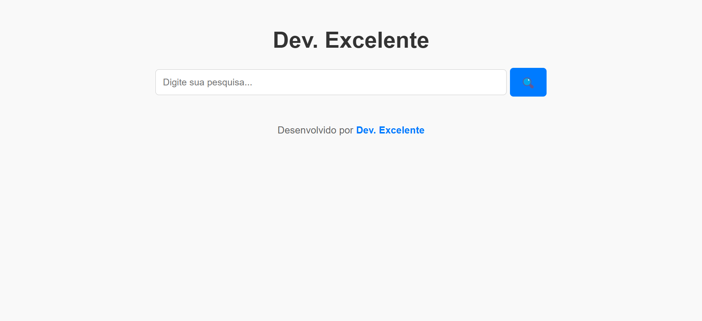

# 🔍 web-search-interface

Um projeto interativo que permite aos usuários realizar pesquisas de forma simples e eficiente.

## 📜 Descrição do Projeto

Este projeto é uma aplicação web que oferece uma interface amigável para busca de informações. O usuário pode digitar sua pesquisa e obter resultados de forma rápida e prática.

## 🚀 Tecnologias Utilizadas

- HTML
- CSS
- JavaScript

## 📁 Estrutura do Projeto

- `index.html` - Estrutura principal da aplicação.
- `style.css` - Estilos da aplicação.
- `scripts.js` - Funcionalidades e interatividade.

## 🎯 Funcionalidades

-  Campo de pesquisa para digitar o que deseja buscar.
-  Botão de pesquisa que inicia a busca.
-  Interface responsiva e intuitiva.

### 📷 Demonstração

### 🔗 Link para o Projeto

👉 [Ver Projeto ao Vivo](https://maike-simoncini.github.io/Plantas-Medicinais/) 👈

### 📄 Licença

Este projeto é de código aberto e pode ser utilizado por qualquer pessoa.
